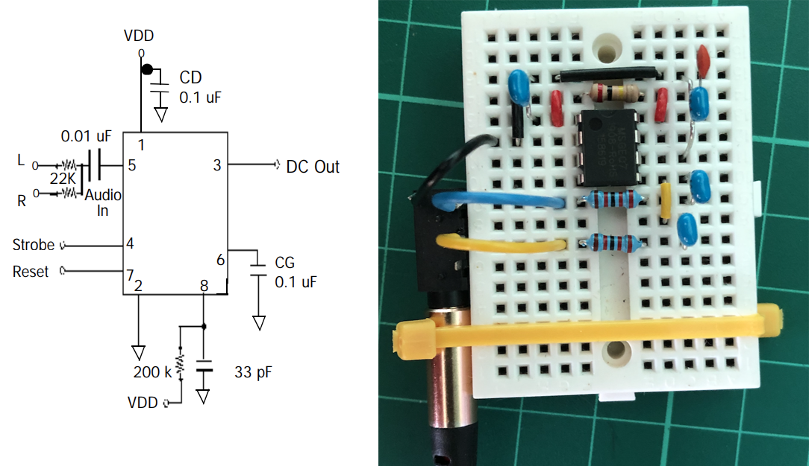
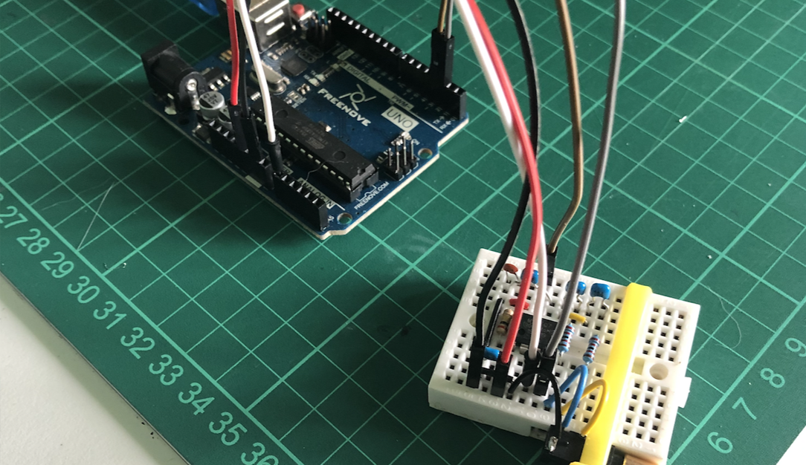
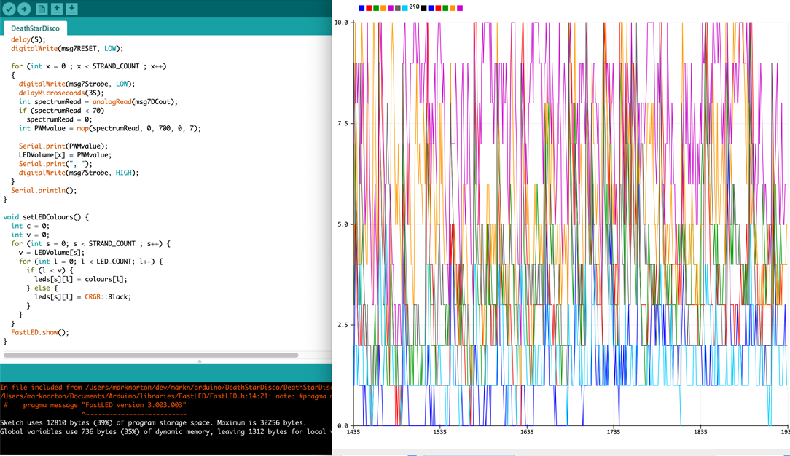
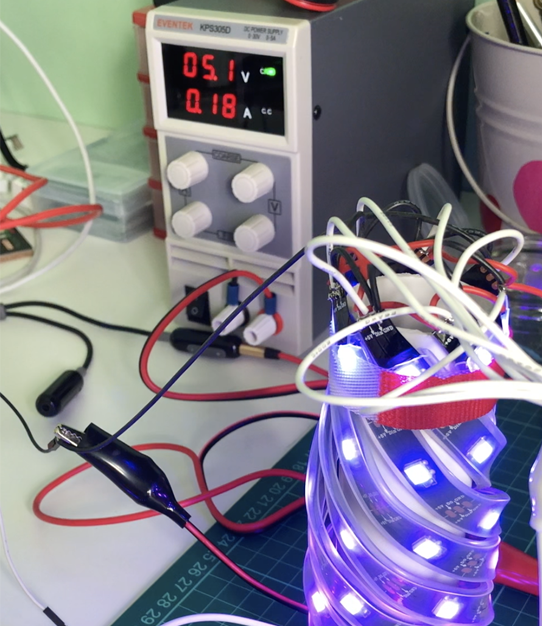
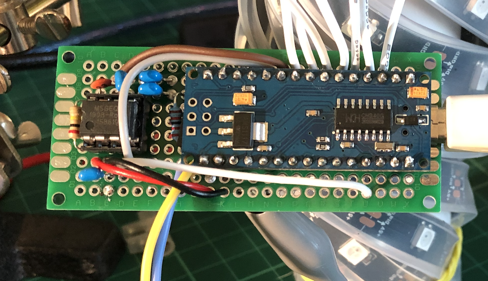
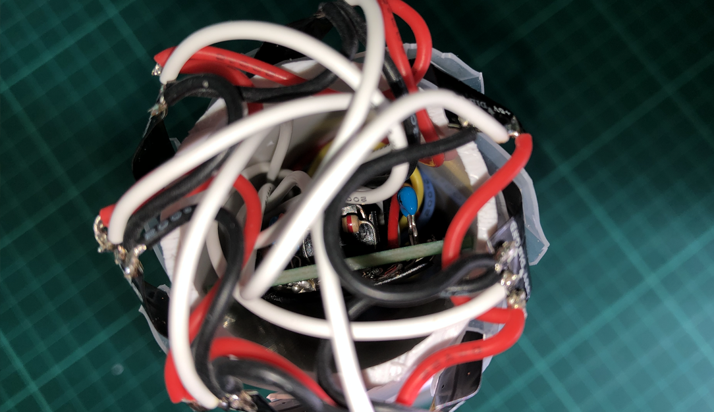
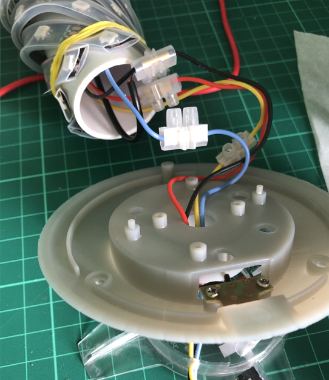
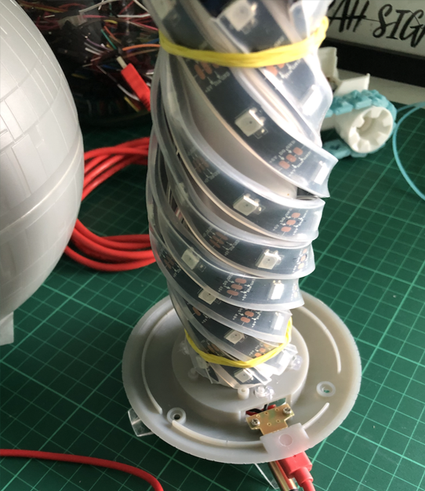
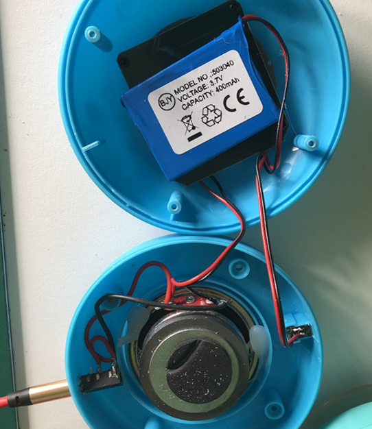
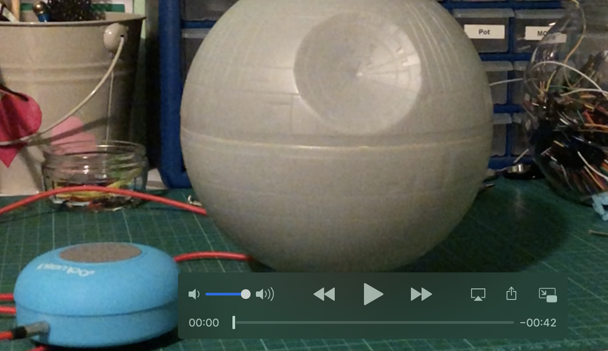

# Death Star Disco

## Parts

- [Death Star nightlight](https://www.geekygiftideas.com/death-star-night-light/) (they must be kidding on the $$$)
- [Arduino Nano (clone)](https://www.amazon.co.uk/ELEGOO-Arduino-board-ATmega328P-compatible/dp/B072BMYZ18/)
- [MSGEQ7](https://www.sparkfun.com/products/10468)
- [Shower Speaker](https://www.amazon.co.uk/Intempo-Bluetooth-Shower-Speaker-Color/dp/B079X3BSJT/)
- Other components
    * 3.5mm M-M audio cable
    * 3.5mm stereo jack sockets (*2)
    * 0.1μF capacitor (*4)
    * 33pf capacitor
    * 22k resistor (*2)
    * 200k resistor
    * [WS2812B LED](https://www.amazon.co.uk/BTF-LIGHTING-Upgraded-Individually-Addressable-Waterproof/dp/B07LG4BCRP/) (*49 in 7 strips of 7)
    * [Assorted lengths of wire](assorted-lengths-of-wire.jpg)
    * short piece of PVC pipe
    * [Prototype board](https://www.amazon.co.uk/Elegoo-Prototype-Soldering-Compatible-Arduino/dp/B073ZHVKC1/)
    * Sacrificial USB cable

## Steps

Wire up the MSGEQ7 according to the [data sheet](MSGEQ7.pdf)

Connect the prototype to an Arduino. Here DC Out is connected to Analogue 0, strobe and reset are connected to D2 and D3 respectively.

Compile and upload [the sketch](DeathStarDisco.ino), connect an audio source, confirm the code and prototype are working by using the Arduino IDE serial plotter.

Affix 7 strands of 7 LEDs to the PVC pipe, elastic bands work well and can be positioned so as to not cover and lights. Solder wires connecting all the +ve and -ve connections of the strands and individual data wires. The final power and ground wires leading from the final strip need to reach out of the bottom of the pipe.

Connect up a power supply (best not use the Arduino to power this as the current draw might exceed the boards limit) and upload a FastLED demo example to [test the wiring](https://s3.us-east-2.amazonaws.com/block17.co.uk/light-test.mov).

Replicate the MSGEQ7 circuit on the prototype board and solder the Arduino Nano alongside. Connect each LED strip to its own digital pin on the Nano. Add a couple of longer wires for the audio signals, they need to reach out of the bottom of the pipe and connect to the 3.5mm stereo socket.

Sacrifice a USB cable and plug it in to the Arduino, this is the simplest way to power it from a 5v source.

Stuff the circuit board into the tube passing the power and signal wires out of the bottom, fold over the top of the strips so they don't resist when the Death Star shell is installed over them.

Solder power wires onto the USB port in the base of the light. Solder signal and ground wires to a 3.5mm stereo socket. Feed all of the wires in through the hole in the base (exhaust port?). Join the wires using terminal connectors (in case of future disassembly). Hot glue the stereo socket to the base near the USB port. The ground for the stereo socket can be connected to the ground at the USB port.

Jam the spare wire up inside the pipe and set the it down on the lamp base.

Put the Death Star shell back on, it should *just* press down on the top of the LED strips enough to keep the pipe in place.

Crack open the shower speaker. Solder wires to the second 3.5mm stereo socket and connect signal and ground to the speaker. Drill a hole in the side of the speaker and glue the socket into it. Close the speaker back up.

## Operation

Connect the speaker to the Death Star with the M-M 3.5mm audio cable. Pair some device to the Bluetooth speaker. Crank up the Rebel Bass!

